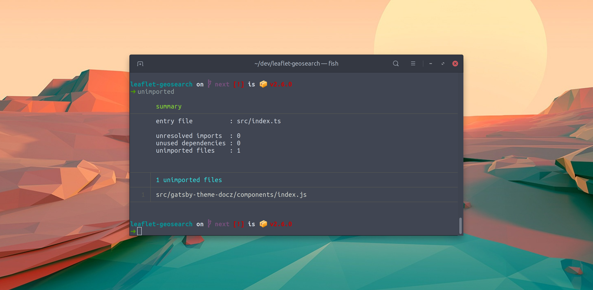

# unimported

**Find unused source files in javascript / typescript projects.**



While adding new code to our projects, we might forget to remove the old code. Linters warn us for unused code in a module, but they fail to report unused files.

`unimported` analyzes your code by following the require/import statements starting from your entry file.

The result is a report showing which files are unimported, which dependencies are missing from your `package.json`, and which dependencies can be removed from your `package.json`.

## Usage

Run the following command in the root of your project (next to `package.json`) The result will be as shown under [example](#example)

```shell
npx unimported
```

## Report

The report will look something like [below](#example). When a particular check didn't have any positive results, it's section will be excluded from the output.

### summary

Summary displays a quick overview of the results, showing the entry points that were used, and some statistics about the outcome.

### unresolved imports

These import statements could not be resolved. This can either be a reference to a local file. Or to a `node_module`. In case of a node module, it can be that nothing is wrong. Maybe you're importing only types from a `DefinitelyTyped` package. But as `unimported` only compares against `dependencies`, it can also be that you've added your module to the `devDependencies`, and that's a problem.

### unused dependencies

Some dependencies that are declared in your package.json, were not imported by your code. It should be possible to remove those packages from your project.

But, please double check. Maybe you need to move some dependencies to `devDependencies`, or maybe it's a peer-dependency from another package. These are hints that something might be wrong. It's no guarantee.

### unimported files

The files listed under `unimported files`, are the files that exist in your code base, but are not part of your final bundle. It should be safe to delete those files.

For your convenience, some files are not shown, as we treat those as 'dev only' files which you might need. More about that [below](#how);

### example

```shell
       summary
────────────────────────────────────────────────
       entry file 1        : src/client/main.js
       entry file 2        : src/server/main.js

       unresolved imports  : 2
       unused dependencies : 29
       unimported files    : 86


─────┬──────────────────────────────────────────
     │ 2 unresolved imports
─────┼──────────────────────────────────────────
   1 │ geojson
   2 │ csstype
─────┴──────────────────────────────────────────


─────┬──────────────────────────────────────────
     │ 29 unused dependencies
─────┼──────────────────────────────────────────
   1 │ @babel/polyfill
   2 │ @babel/runtime
  .. │ ...
─────┴──────────────────────────────────────────


─────┬──────────────────────────────────────────
     │ 7 unimported files
─────┼──────────────────────────────────────────
   1 │ src/common/components/Button/messages.ts
   2 │ src/common/configs/sentry/graphql.js
  .. │ ...
─────┴──────────────────────────────────────────
```

## How

`Unimported` follows your import statements, starting from one or more entry files. For Meteor projects, the entry files are read from the `package.json#meteor.mainModule` key. Meteors eager loading is not supported, as that mode will load all files within your directory, regardless of import statements.

For all other project types, the entry point is looked up in the following order:

1. `./package.json#source`
1. `./src/index`
1. `./src/main`
1. `./index`
1. `./main`
1. `./package.json#main`

The last option is most likely never what you want, as the main field often points to a `dist` folder. Analyzing a bundled asset, is likely to result in false positives.

**extensions**

The resolver scans for files with the following extensions, in this specific order:

1. `.js`
1. `.jsx`
1. `.ts`
1. `.tsx`

All other files are ignored.

**ignored**

Also ignored are files with paths matching the following patterns:

```
**/node_modules/**
**/*.stories.{js,jsx,ts,tsx}
**/*.tests.{js,jsx,ts,tsx}
**/*.spec.{js,jsx,ts,tsx}
```

In case `unimported` is running in a `Meteor` project, the following paths are being ignored as well:

```
packages
```

## Gotchas

At this moment, we don't support the `export default from './x'` export syntax. Parsing files that contain those exports, will result in an error with a message like `'\';\' expected`.

If you make use of that part of the [export default from proposal](https://github.com/tc39/proposal-export-default-from#exporting-a-default-as-default), you can consider a find/replace before running `unimported`.

Please search for:

```shell
export default from
```

and replace it with

```shell
export { default } from
```

It ain't pretty, but it should work.

## See Also

- [unrequired](npmjs.com/unrequired)
- [trucker](https://npmjs.com/trucker)
