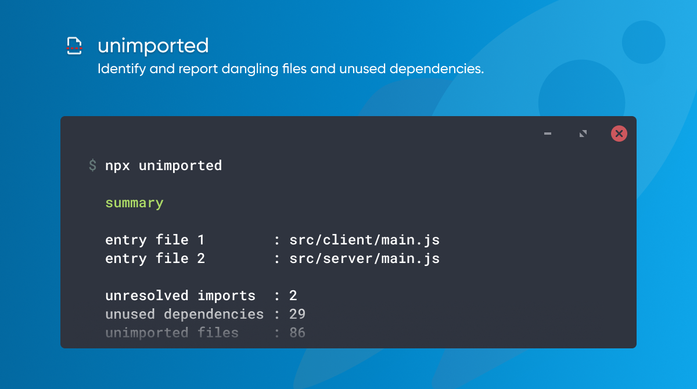

# unimported

**Find unused source files in javascript / typescript projects.**



While adding new code to our projects, we might forget to remove the old code. Linters warn us for unused code in a module, but they fail to report unused files.

`unimported` analyzes your code by following the require/import statements starting from your entry file.

The result is a report showing which files are unimported, which dependencies are missing from your `package.json`, and which dependencies can be removed from your `package.json`.

## Usage

Run the following command in the root of your project (next to `package.json`) The result will be as shown under [example](#example)

```shell
npx unimported
```

## Options

Output all options in your terminal:

```shell
npx unimported --help
```

### Init

This option will write the default ignore patterns to the `.unimportedrc.json` settings files. This will enable you to easily adjust them to your needs.

```shell
npx unimported --init
```

### Update

Update, will write the current results to the ignore lists in `.unimportedrc.json`. You want to use this option **after running and verifying** a full scan. Ignore lists are used to ignore certain false positives that could not be resolved properly. This is especially useful when running `unimported` on a regular basis, or for example as part of a CI pipeline.

```shell
npx unimported --update
```

### Flow Type

If your project is using flow type for typing, you might need this flag.

```shell
npx unimported --flow
```

### Example Config File

Save the file as `.unimportedrc.json` in the root of your project (next to `package.json`)

```json
{
  "entry": ["src/main.ts", "src/pages/**/*.{js,ts}"],
  "extensions": [".ts", ".js"],
  "ignorePatterns": ["**/node_modules/**", "private/**"],
  "ignoreUnresolved": ["some-npm-dependency"],
  "ignoreUnimported": ["src/i18n/locales/en.ts", "src/i18n/locales/nl.ts"],
  "ignoreUnused": ["bcrypt", "create-emotion"]
}
```

**Custom module directory**
You can also add an optional `moduleDirectory` option to your configuration file to resolve dependencies from other directories than `node_modules`. This setting defaults to `node_modules`.

```json
{
  "moduleDirectory": ["node_modules", "src/app"]
}
```

**Custom aliases**
If you wish to use aliases to import your modules & these can't be imported
directly (e.g. `tsconfig.json` in the case of Typescript), there is an option `aliases` to provide the correct path mapping:

```json
{
  "aliases": {
    "@components/*": ["./components", "./components/*"],
    ...
  }
}
```

_Note:_ you may wish to also add the `rootDir` option to specify the base path to
start looking for the aliases from:

```json
{
  "rootDir": "./src"
}
```

## Report

The report will look something like [below](#example). When a particular check didn't have any positive results, it's section will be excluded from the output.

### summary

Summary displays a quick overview of the results, showing the entry points that were used, and some statistics about the outcome.

### unresolved imports

These import statements could not be resolved. This can either be a reference to a local file. Or to a `node_module`. In case of a node module, it can be that nothing is wrong. Maybe you're importing only types from a `DefinitelyTyped` package. But as `unimported` only compares against `dependencies`, it can also be that you've added your module to the `devDependencies`, and that's a problem.

To ignore specific results, add them to `.unimportedrc.json#ignoreUnresolved`.

### unused dependencies

Some dependencies that are declared in your package.json, were not imported by your code. It should be possible to remove those packages from your project.

But, please double check. Maybe you need to move some dependencies to `devDependencies`, or maybe it's a peer-dependency from another package. These are hints that something might be wrong. It's no guarantee.

To ignore specific results, add them to `.unimportedrc.json#ignoreUnused`.

### unimported files

The files listed under `unimported files`, are the files that exist in your code base, but are not part of your final bundle. It should be safe to delete those files.

For your convenience, some files are not shown, as we treat those as 'dev only' files which you might need. More about that [below](#how).

To ignore specific results, add them to `.unimportedrc.json#ignoreUnimported`.

### example

```shell
       summary
────────────────────────────────────────────────
       entry file 1        : src/client/main.js
       entry file 2        : src/server/main.js

       unresolved imports  : 2
       unused dependencies : 29
       unimported files    : 86


─────┬──────────────────────────────────────────
     │ 2 unresolved imports
─────┼──────────────────────────────────────────
   1 │ geojson
   2 │ csstype
─────┴──────────────────────────────────────────


─────┬──────────────────────────────────────────
     │ 29 unused dependencies
─────┼──────────────────────────────────────────
   1 │ @babel/polyfill
   2 │ @babel/runtime
  .. │ ...
─────┴──────────────────────────────────────────


─────┬──────────────────────────────────────────
     │ 7 unimported files
─────┼──────────────────────────────────────────
   1 │ src/common/components/Button/messages.ts
   2 │ src/common/configs/sentry/graphql.js
  .. │ ...
─────┴──────────────────────────────────────────
```

## How

`Unimported` follows your import statements starting from one or more entry files. For nextjs projects, the entry files default to `pages/**`. For Meteor projects, the entry files are read from the `package.json#meteor.mainModule` key. Meteors eager loading is not supported, as that mode will load all files within your directory, regardless of import statements.

For all other project types, the entry point is looked up in the following order:

1. `./package.json#source`
1. `./src/index`
1. `./src/main`
1. `./index`
1. `./main`
1. `./package.json#main`

The last option is most likely never what you want, as the main field often points to a `dist` folder. Analyzing a bundled asset is likely to result in false positives.

To specify custom entry points, add them to `.unimportedrc.json#entry`.

**extensions**

The resolver scans for files with the following extensions, in this specific order:

1. `.js`
1. `.jsx`
1. `.ts`
1. `.tsx`

All other files are ignored.

To specify custom extensions, add your own list to .unimportedrc.json#extensions`. Note that`unimported` won't merge settings! The custom list needs to be the full list of extension that you want to support.

**ignored**

Also ignored are files with paths matching the following patterns:

```
**/node_modules/**
**/*.stories.{js,jsx,ts,tsx}
**/*.tests.{js,jsx,ts,tsx}
**/*.spec.{js,jsx,ts,tsx}
```

In case `unimported` is running in a `Meteor` project, the following paths are being ignored as well:

```
packages/**
public/**
private/**
tests/**
```

To specify custom ignore paths, add your own patterns to `.unimportedrc.json#ignorePatterns`. Note that `unimported` won't merge settings! The custom list needs to be the full list of patterns that you want to ignore.

## Gotchas

At this moment, we don't support the `export default from './x'` export syntax. Parsing files that contain those exports, will result in an error with a message like `'\';\' expected`.

If you make use of that part of the [export default from proposal](https://github.com/tc39/proposal-export-default-from#exporting-a-default-as-default), you can consider a find/replace before running `unimported`.

Please search for:

```shell
export default from
```

and replace it with

```shell
export { default } from
```

It ain't pretty, but it should work.

## See Also

- [unrequired](https://npmjs.com/unrequired)
- [trucker](https://npmjs.com/trucker)

## License

[](https://github.com/smeijer/unimported/blob/main/LICENSE)

## Contributors ✨

Thanks goes to these wonderful people ([emoji key](https://allcontributors.org/docs/en/emoji-key)):

<!-- ALL-CONTRIBUTORS-LIST:START - Do not remove or modify this section -->
<!-- prettier-ignore-start -->
<!-- markdownlint-disable -->
<table>
  <tr>
    <td align="center"><a href="https://github.com/smeijer"><br /><sub><b>Stephan Meijer</b></sub></a><br /><a href="#ideas-smeijer" title="Ideas, Planning, & Feedback">🤔</a> <a href="https://github.com/smeijer/unimported/commits?author=smeijer" title="Code">💻</a> <a href="#infra-smeijer" title="Infrastructure (Hosting, Build-Tools, etc)">🚇</a> <a href="#maintenance-smeijer" title="Maintenance">🚧</a></td>
    <td align="center"><a href="https://in.linkedin.com/in/punit-makwana/"><br /><sub><b>Punit Makwana</b></sub></a><br /><a href="https://github.com/smeijer/unimported/commits?author=punit2502" title="Documentation">📖</a></td>
    <td align="center"><a href="https://github.com/danew"><br /><sub><b>Dane Wilson</b></sub></a><br /><a href="https://github.com/smeijer/unimported/commits?author=danew" title="Code">💻</a></td>
    <td align="center"><a href="https://github.com/mpeyper"><br /><sub><b>Michael Peyper</b></sub></a><br /><a href="https://github.com/smeijer/unimported/commits?author=mpeyper" title="Tests">⚠️</a> <a href="https://github.com/smeijer/unimported/commits?author=mpeyper" title="Code">💻</a></td>
    <td align="center"><a href="https://github.com/marcosvega91"><br /><sub><b>Marco Moretti</b></sub></a><br /><a href="https://github.com/smeijer/unimported/commits?author=marcosvega91" title="Tests">⚠️</a></td>
    <td align="center"><a href="http://peter.hozak.info/"><br /><sub><b>Peter Hozák</b></sub></a><br /><a href="https://github.com/smeijer/unimported/commits?author=Aprillion" title="Tests">⚠️</a></td>
    <td align="center"><a href="https://dev.to/jacobmgevans"><br /><sub><b>Jacob M-G Evans</b></sub></a><br /><a href="https://github.com/smeijer/unimported/commits?author=JacobMGEvans" title="Tests">⚠️</a></td>
  </tr>
  <tr>
    <td align="center"><a href="https://github.com/datner"><br /><sub><b>Datner</b></sub></a><br /><a href="https://github.com/smeijer/unimported/commits?author=datner" title="Tests">⚠️</a></td>
    <td align="center"><a href="https://github.com/codyarose"><br /><sub><b>Cody Rose</b></sub></a><br /><a href="https://github.com/smeijer/unimported/commits?author=codyarose" title="Tests">⚠️</a></td>
    <td align="center"><a href="https://ahmedeldessouki-a7488.firebaseapp.com/"><br /><sub><b>Ahmed ElDessouki</b></sub></a><br /><a href="https://github.com/smeijer/unimported/commits?author=AhmedEldessouki" title="Tests">⚠️</a></td>
    <td align="center"><a href="https://www.linkedin.com/in/ypazevedo/"><br /><sub><b>Yago Pereira Azevedo</b></sub></a><br /><a href="https://github.com/smeijer/unimported/commits?author=YPAzevedo" title="Tests">⚠️</a></td>
    <td align="center"><a href="https://github.com/juhanakristian"><br /><sub><b>Juhana Jauhiainen</b></sub></a><br /><a href="https://github.com/smeijer/unimported/commits?author=juhanakristian" title="Tests">⚠️</a></td>
    <td align="center"><a href="https://github.com/nobrayner"><br /><sub><b>Braydon Hall</b></sub></a><br /><a href="https://github.com/smeijer/unimported/commits?author=nobrayner" title="Tests">⚠️</a></td>
    <td align="center"><a href="https://github.com/abeprincec"><br /><sub><b>abeprincec</b></sub></a><br /><a href="https://github.com/smeijer/unimported/commits?author=abeprincec" title="Tests">⚠️</a></td>
  </tr>
  <tr>
    <td align="center"><a href="http://www.code-root.com/"><br /><sub><b>Lucas Westermann</b></sub></a><br /><a href="https://github.com/smeijer/unimported/commits?author=lswest" title="Code">💻</a> <a href="https://github.com/smeijer/unimported/commits?author=lswest" title="Tests">⚠️</a></td>
    <td align="center"><a href="https://github.com/simonwinter"><br /><sub><b>Simon Winter</b></sub></a><br /><a href="https://github.com/smeijer/unimported/commits?author=simonwinter" title="Code">💻</a> <a href="https://github.com/smeijer/unimported/commits?author=simonwinter" title="Tests">⚠️</a></td>
    <td align="center"><a href="https://github.com/stovmascript"><br /><sub><b>Martin Šťovíček</b></sub></a><br /><a href="https://github.com/smeijer/unimported/commits?author=stovmascript" title="Documentation">📖</a></td>
    <td align="center"><a href="http://www.incaseofstairs.com/"><br /><sub><b>Kevin Decker</b></sub></a><br /><a href="https://github.com/smeijer/unimported/commits?author=kpdecker" title="Code">💻</a> <a href="https://github.com/smeijer/unimported/commits?author=kpdecker" title="Tests">⚠️</a></td>
    <td align="center"><a href="https://github.com/olidacombe"><br /><sub><b>olidacombe</b></sub></a><br /><a href="https://github.com/smeijer/unimported/commits?author=olidacombe" title="Code">💻</a></td>
    <td align="center"><a href="https://in.linkedin.com/in/punit-makwana/"><br /><sub><b>Punit Makwana</b></sub></a><br /><a href="https://github.com/smeijer/unimported/commits?author=punitcodes" title="Documentation">📖</a></td>
    <td align="center"><a href="https://github.com/kkpalanisamy"><br /><sub><b>Palanisamy KK</b></sub></a><br /><a href="https://github.com/smeijer/unimported/commits?author=kkpalanisamy" title="Documentation">📖</a></td>
  </tr>
</table>

<!-- markdownlint-restore -->
<!-- prettier-ignore-end -->

<!-- ALL-CONTRIBUTORS-LIST:END -->

This project follows the [all-contributors](https://github.com/all-contributors/all-contributors) specification. Contributions of any kind welcome!
